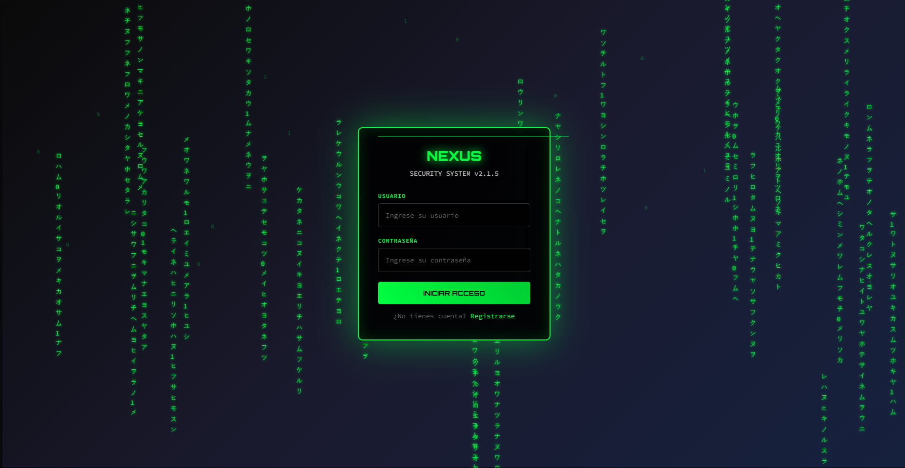
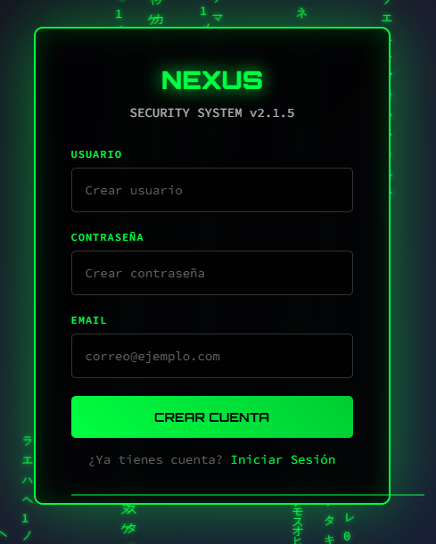
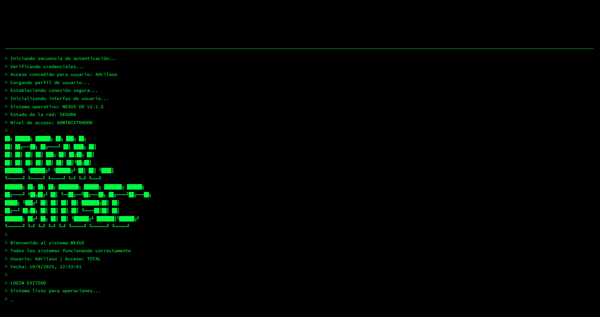

# Login basico con temática hacker
Login con registro y verificacion de credenciales con tematica hacker

# Tabla de contenidos:
- [ Caracteristicas:](#caracteristicas)
- [ Instalacion:](#instalacion)
- [ Capturas:](#capturas)
- [ Tecnologias:](#tecnologias)
- [ Licencia](#licencia)

# Caracteristicas:
> >Apartado de Registro con nombre, contraseña y correo

> >Login con verificacion de credenciales

> >Pantalla de Login con exito

# Instalacion:
```bash
git clone https://github.com/Adri-Coding-Dev/Basic_Login
cd Basic_Login
# Ejecuta el index.html en tu navegador favorito
```

# Capturas
## Pagina principal

## Registro

## Login completado


# Tecnologias:
> >HTML5

> >CSS3

> >JavaScript

# Licencia:
Este proyecto esta bajo la licencia MIT